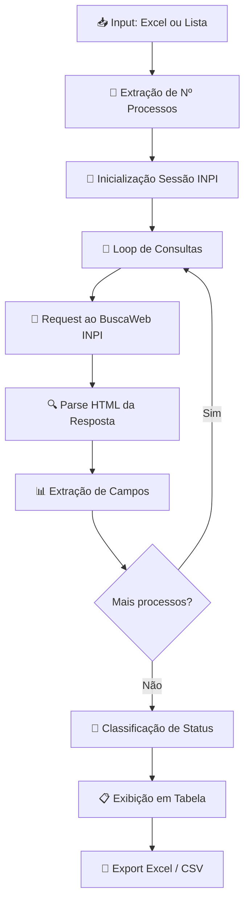
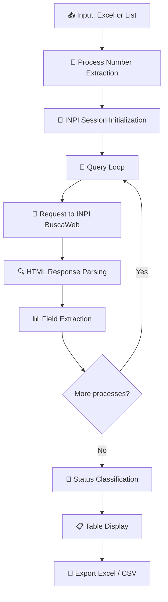

<h1 align="center">
  <br>🔎 INPédia — Consulta Inteligente de Marcas INPI</h1>

<div align="center">

<!-- Demo GIF -->
<!--  -->

[](https://www.python.org/)
[](https://streamlit.io/)
[](./LICENSE)

</div>

---

<a id="pt-readme"></a>

## 🌐 [English](#en-readme) | Português

### 🚀 Acesse o aplicativo: **[inpedia.streamlit.app](https://inpedia.streamlit.app/)**

---

## 📋 Sobre o Projeto

**INPédia** é uma ferramenta de automação desenvolvida para consultar processos de marcas no **INPI (Instituto Nacional da Propriedade Industrial)** de forma rápida, organizada e em lote.

A aplicação foi construída com **Python** e **Streamlit**, oferecendo uma interface web moderna e intuitiva que substitui o processo manual de verificação individual de cada protocolo de marca na plataforma do governo.

### 🏛️ O que é o INPI?

O **INPI (Instituto Nacional da Propriedade Industrial)** é a autarquia federal brasileira responsável pelo registro e concessão de marcas, patentes, desenhos industriais, transferências de tecnologia e indicações geográficas. A consulta pública de marcas é feita através do sistema **BuscaWeb** em [busca.inpi.gov.br](https://busca.inpi.gov.br).

### 🎯 Propósito

Automatizar a verificação de estado de protocolos de marcas registradas no INPI, eliminando a necessidade de consultas manuais individuais. Ideal para escritórios de propriedade intelectual, departamentos jurídicos e empresas que gerenciam múltiplas marcas.

---

## ✨ Funcionalidades Principais

| Funcionalidade | Descrição |
|---------------|-----------|
| 📤 **Upload de Excel** | Interface drag-and-drop para importar planilhas com números de processos |
| 📋 **Colar Lista** | Cole diretamente uma lista de processos copiada do Excel |
| 🔍 **Consulta em Lote** | Processamento automático de múltiplos processos com barra de progresso |
| 🚦 **Semáforo de Status** | Indicadores visuais (✅❌®️🟡) para rápida identificação da situação |
| 📊 **Exportação Excel/CSV** | Download dos resultados em formatos prontos para uso |
| 📋 **Tabela Interativa** | Visualização com ordenação por colunas |
| ⚡ **Delay Configurável** | Controle do intervalo entre consultas para evitar bloqueios |

---

## 🏗️ Arquitetura da Solução



---

## 📊 Dados Extraídos

| Campo | Descrição |
|-------|-----------|
| **Nº Processo** | Número do processo de marca |
| **Marca** | Nome da marca registrada |
| **Situação** | Status atual do processo |
| **Status** | 🚦 Semáforo visual do status |
| **Apresentação** | Tipo de apresentação da marca |
| **Natureza** | Natureza da marca |
| **Titular** | Titular da marca |
| **Procurador** | Procurador responsável |
| **Data Depósito** | Data de depósito do pedido |
| **Data Concessão** | Data de concessão (se aplicável) |
| **Data Vigência** | Data de vigência do registro |
| **Classe Nice** | Classificação Internacional de Nice |
| **Especificação** | Descrição dos produtos/serviços |
| **Último Despacho** | RPI, data e título do último despacho |

### 🚦 Legenda do Semáforo

| Indicador | Significado |
|-----------|-------------|
| ✅ | Aguardando exame de mérito / Deferido |
| ®️ | Registro de marca em vigor |
| ❌ | Indeferido / Extinto / Arquivado |
| 🟡 | Oposição / Sobrestado |
| ⚪ | Outro status |

---

## 📁 Estrutura do Projeto

```
INPedia/
│
├── 📄 app.py                      # Interface Streamlit (UI/UX)
├── 🔧 inpi_engine.py              # Motor de consulta ao INPI
├── 🔍 inpi_parser.py              # Parser HTML dos resultados
├── 📋 requirements.txt            # Dependências Python
├── 📖 README.md                   # Documentação
│
└── 📂 .streamlit/
    └── ⚙️ config.toml             # Tema e configurações Streamlit
```

---

## 🚀 Guia de Instalação

### Pré-requisitos

- Python 3.8 ou superior
- pip (gerenciador de pacotes)
- Conexão com a internet (para acessar o INPI)

### 1️⃣ Clone o Repositório

```bash
git clone https://github.com/GabrielaSchmitt/INPedia.git
cd INPedia
```

### 2️⃣ Crie o Ambiente Virtual

**Windows (PowerShell):**
```bash
python -m venv venv
.\venv\Scripts\Activate.ps1
```

**Linux/Mac:**
```bash
python -m venv venv
source venv/bin/activate
```

### 3️⃣ Instale as Dependências

```bash
pip install -r requirements.txt
```

### 4️⃣ Execute a Aplicação

```bash
streamlit run app.py
```

A aplicação será aberta automaticamente no navegador em `http://localhost:8501`

---

## 📖 Como Usar

### Passo a Passo

1. **Importe seus processos**
   - 📄 Faça upload de um arquivo Excel (.xlsx) com os números dos processos
   - 📋 Ou cole uma lista de processos diretamente na caixa de texto

2. **Configure e consulte**
   - ⚙️ Ajuste o delay entre consultas (padrão: 0.5s)
   - 🔘 Clique em **"CONSULTAR PROCESSOS"**
   - 📊 Acompanhe o progresso pela barra de carregamento

3. **Exporte os resultados**
   - 📥 Baixe em **Excel (.xlsx)** ou **CSV**
   - 📋 Visualize na tabela interativa com semáforo de status
   - 🔄 Clique em **"Realizar nova consulta"** para recomeçar

---

## 🤝 Suporte

Para dúvidas, problemas ou sugestões:

📧 **Contato:** [GitHub Issues](https://github.com/GabrielaSchmitt/INPedia/issues)

---

## 📄 Licença

Este projeto é de uso pessoal/interno. Todos os dados consultados são provenientes da [Pesquisa Pública do INPI](https://busca.inpi.gov.br).

---

<div align="center">

**INPédia** 🔎 © 2026 — Gabriela Schmitt

</div>

---
---

<a id="en-readme"></a>

## 🌐 English | [Português](#pt-readme)

### 🚀 Access the application: **[inpedia.streamlit.app](https://inpedia.streamlit.app/)**

---

## 📋 About the Project

**INPédia** is an automation tool developed to query trademark processes at **INPI (Brazilian National Institute of Industrial Property)** quickly, organized, and in batch.

Built with **Python** and **Streamlit**, the application offers a modern and intuitive web interface that replaces the manual process of individually checking each trademark protocol on the government platform.

### 🏛️ What is INPI?

**INPI (Instituto Nacional da Propriedade Industrial)** is the Brazilian federal agency responsible for the registration and granting of trademarks, patents, industrial designs, technology transfers, and geographical indications. Public trademark searches are done through the **BuscaWeb** system at [busca.inpi.gov.br](https://busca.inpi.gov.br).

### 🎯 Purpose

Automate the verification of trademark protocol statuses registered at INPI, eliminating the need for individual manual queries. Ideal for intellectual property offices, legal departments, and companies managing multiple trademarks.

---

## ✨ Key Features

| Feature | Description |
|---------|-------------|
| 📤 **Excel Upload** | Drag-and-drop interface for importing spreadsheets with process numbers |
| 📋 **Paste List** | Directly paste a list of processes copied from Excel |
| 🔍 **Batch Query** | Automatic processing of multiple processes with progress bar |
| 🚦 **Status Semaphore** | Visual indicators (✅❌®️🟡) for quick status identification |
| 📊 **Excel/CSV Export** | Download results in ready-to-use formats |
| 📋 **Interactive Table** | Visualization with column sorting |
| ⚡ **Configurable Delay** | Control interval between queries to avoid blocking |

---

## 🏗️ Solution Architecture



---

## 📊 Extracted Data

| Field | Description |
|-------|-------------|
| **Process Nº** | Trademark process number |
| **Trademark** | Registered trademark name |
| **Status** | Current process status |
| **Indicator** | 🚦 Visual status semaphore |
| **Presentation** | Trademark presentation type |
| **Nature** | Trademark nature |
| **Holder** | Trademark holder |
| **Attorney** | Responsible attorney |
| **Filing Date** | Application filing date |
| **Grant Date** | Grant date (if applicable) |
| **Validity Date** | Registration validity date |
| **Nice Class** | International Nice Classification |
| **Specification** | Products/services description |
| **Latest Dispatch** | RPI, date, and title of latest dispatch |

### 🚦 Semaphore Legend

| Indicator | Meaning |
|-----------|---------|
| ✅ | Awaiting merit examination / Granted |
| ®️ | Active trademark registration |
| ❌ | Rejected / Extinct / Archived |
| 🟡 | Opposition / Stayed |
| ⚪ | Other status |

---

## 📁 Project Structure

```
INPedia/
│
├── 📄 app.py                      # Streamlit interface (UI/UX)
├── 🔧 inpi_engine.py              # INPI query engine
├── 🔍 inpi_parser.py              # HTML results parser
├── 📋 requirements.txt            # Python dependencies
├── 📖 README.md                   # Documentation
│
└── 📂 .streamlit/
    └── ⚙️ config.toml             # Streamlit theme and settings
```

---

## 🚀 Installation Guide

### Prerequisites

- Python 3.8 or higher
- pip (package manager)
- Internet connection (to access INPI)

### 1️⃣ Clone the Repository

```bash
git clone https://github.com/GabrielaSchmitt/INPedia.git
cd INPedia
```

### 2️⃣ Create Virtual Environment

**Windows (PowerShell):**
```bash
python -m venv venv
.\venv\Scripts\Activate.ps1
```

**Linux/Mac:**
```bash
python -m venv venv
source venv/bin/activate
```

### 3️⃣ Install Dependencies

```bash
pip install -r requirements.txt
```

### 4️⃣ Run the Application

```bash
streamlit run app.py
```

The application will automatically open in your browser at `http://localhost:8501`

---

## 📖 How to Use

### Step by Step

1. **Import your processes**
   - 📄 Upload an Excel file (.xlsx) with process numbers
   - 📋 Or paste a list of processes directly into the text box

2. **Configure and query**
   - ⚙️ Adjust the delay between queries (default: 0.5s)
   - 🔘 Click **"CONSULTAR PROCESSOS"**
   - 📊 Track progress via the loading bar

3. **Export results**
   - 📥 Download as **Excel (.xlsx)** or **CSV**
   - 📋 View in the interactive table with status semaphore
   - 🔄 Click **"Realizar nova consulta"** to start over

---

## 🤝 Support

For questions, issues, or suggestions:

📧 **Contact:** [GitHub Issues](https://github.com/GabrielaSchmitt/INPedia/issues)

---

## 📄 License

This project is for personal/internal use. All queried data comes from the [INPI Public Search](https://busca.inpi.gov.br).

---

<div align="center">

**INPédia** 🔎 © 2026 — Gabriela Schmitt

</div>
